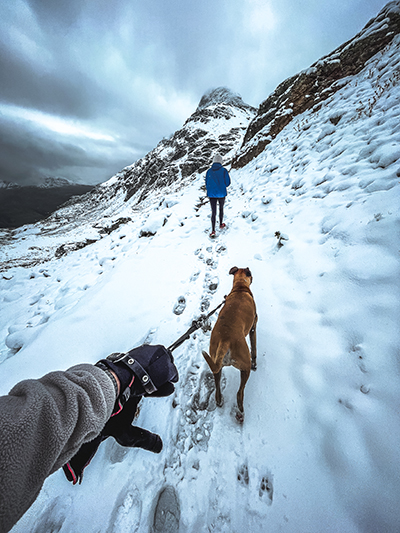

# Vision-Keywords
__Image Keyword Generation with OpenAI GPT-4__

Blog post [here](https://larsgeb.github.io/2023/12/20/vision-keywords.html).

## Overview

This script utilizes the OpenAI GPT-4 API to generate keywords and titles for
images. It resizes images, extracts existing keywords from IPTC data, and sends
a request to the OpenAI API to generate relevant keywords and titles. The
results are then applied to copies of the images, updating their metadata.

## Installation

1. **Clone the Repository:**

```bash
git clone https://github.com/your-username/image-keyword-generation.git
cd image-keyword-generation
```

2. **Install Dependencies:**

Ensure you have Python installed. Install the required dependencies using:

```bash
pip install -r requirements.txt
```

3. **Obtain OpenAI API Key:**

You need an OpenAI API key to use this script. [Learn how to get your API key here.](https://platform.openai.com/docs/quickstart?context=python)

4. **Set API Key:**

Open the script in a text editor and replace the placeholder API key with your
actual OpenAI API key.

## Usage

1. Organize Images:

Place the images you want to process in the input folder,
`/Users/yourusername/Desktop/Input` by default.

2. Run the Script:
Execute the script by running:

```bash
python keyword_images.py
```

This will process the images, interact with the OpenAI API, and update metadata.

3. View Output:
Processed images and their updated metadata will be available in the output
folder, `/Users/yourusername/Desktop/output` by default.

## Additional Notes

**API Usage**: The script uses the OpenAI GPT-4 API, and usage is subject to
OpenAI's terms and conditions. Using this script and its generated billing with
OpenAI is your own responsibility.

**Results Storage**: Intermediate results are stored in results.pkl. This file is
updated after processing each image. 

**Adjustments**: Modify the script as needed, such as changing input/output
directories or adjusting image dimensions. 

**License**: This project is licensed under the MIT License. Copyright Lars
Gebraad.


# Stop keywording your stock photos

I am … not sure what I fully am. I have a job as an R&D engineer. At the same
time, I have a degree in the somewhat related field of seismic imaging, where
I’ve dabbled with different algorithms. I also own a camera and have been known
to side-hustle with it.

I like that balance — the grind professional artists often go through seems
hard. The physics/programming day job is very fun and stable, which keeps me
fully a ‘prosumer’ in the camera world. I wouldn’t say my pictures are
revolutionary, but I enjoy them, the occasional print gets sold to an
acquaintance and here and there I do some shoot for a customer. And, I sell
stock photos.

I hate doing stock photos. It’s a labour of volume and tediousness. Every photo
needs a title, and for discoverability, at least a good number of keywords that
not only convey the contents of an image, but preferably some emotion or
understanding of the image, to reach the customers the image is perfect for.
This a boring work to me. Submitting more than 3 images is mind numbing, even
with the keyword suggestions most platforms use nowadays. I don't want to click
through each of them!

Image recognition machine learning models are exciting to me, for it would take
the most boring part out of a workflow that nets me only a few dollars per
month. These models take an image, and try to recognise its content in a
specific way. That could be objects in the photo, depth understanding, or
whatever the model is trained for.

Earlier image recognition models were a step in this direction. You get some
hints as to what an image contains, but largely, the output generated by simple
image to object models is not appropriate for production work -- I do not want
the keyword "rock" 32 times. I want something that understands the scene, its
intent, etc. I want a human touch.

But a human touch is expensive. It's either me, which makes it expensive
time-wise. I am not sure if there are keywording services, but if they exist, I
doubt they'd be worth it. So we need a halfway solution that is affordable, but
better than the computer equivalent o a toddler pointing at things and naming
them.

The real kicker is combining image recognition with a model that has larger
understanding of the world at large, Large Language Models. This is horribly
phrased, as LLMs don’t actually understand jackshit. They are amazing at
parroting information, and transposing information between situations. Show it
twenty discussions on stock photography keywording, and it will parrot great
keywords for an image that contains a sunset and a cow. Repetitive work that has
been done before, now condensed into a service. Let’s not talk about who did the
original work, lest we open that can of worms.

## GPT-4 Vision

So, how does one go from an image to keywords ripe for stock photography? How do
we couple a text to image with a LLM? Fear not, the hard part is already
finished. One of the latest models that OpenAI exposes through their API is the
[`gpt-4-vision-preview`](https://platform.openai.com/docs/guides/vision), which
interfaces a image recognition input with then typical GPT interaction. The
cost? Well, money. 



  **Original keywords**
  Engadin, Switzerland

  **Generated title**
  Winter Trek with Dog in Swiss Alps

  **Generated keywords** Winter, Alps, Hiking, Engadin, Outdoor, Mountains,
  Nature, Switzerland, Snow, Adventure, Travel, Trekking, Cold, Scenic,
  Landscape, Exploration, Snowy Trail, Dog Walking, Companion, Pet, Leisure
  Activity, Friendship, Human and Animal, Exercise, Backpack, Cloudy Sky,
  Footprints, Hiking Trail, Active Lifestyle, Remote Location, Wide Angle View

How the OpenAI exposes their models is through an API. Unfortunately, this means
that we need to use a self-programmed tool to get our images into their model,
and get their response back. Their business model is that each requests costs a
small amount of compute credits, which can be directly bought (or billed)
through their website.

## My workflow

I normally go about my year, and organise my photos in Lightroom. Once in a
while I say to myself, wow I should really get these 100 images onto e.g. Adobe
Stock. However, I don't generally use the tagging system unless for really
specific tags, nor do I use captions. Hence, getting my images in a discoverable
state will take quite some work. Here enters I-to-T+LLM. To follow along you
need to be a bit savvy with computers -- the minimal requirements would be to at
least install Python 3. 

My ideal approach is that I tag each series at least with a location, and
possibly some very general keywords about a whole series of photos. Then, using
a combination of various Python packages (e.g. `PIL` and a very outdated module
called `piexif` which should definitely be replaced), I was able to hack
together a script that takes a bunch of input images, queries the image through
OpenAI's model together with the following request:

```
I want thirty keywords to describe this image for Adobe Stock, targeted towards discoverability. These keywords are already present: {existing_kws}, please include the ones that are relevant or location specific. Please output them comma separated. Please as the first entry, output an editorialized title, also separated by commas. Don't output any other characters.
```


  **Original keywords**
  Engadin, Switzerland

  **Generated title**
  Starry Night over Swiss Alpine Cabin

  **Generated keywords** Switzerland, Night, Milky Way, Alps, Stars, Outdoor,
  Engadin, Hiking, Nature, Mountains, Astronomy, Astrophotography,
  Constellations, Galaxy, Universe, Stargazing, Cosmic, Night Sky, Dark, Stone
  Cabin, Secluded, Travel, Adventure, Wilderness, Remote, Cosy, Twilight,
  Serenity, Tranquil, Landscape

The neatest thing? I was able to put all this information back into the file in
one go, such that the only thing that needs to be done afterwards is to upload
to (e.g.) Adobe Stock. Their platform automatically recognises the tags and the
generated image. 

In total, I was able to tag 127 images for about 75 cents. Now, for some people
this might be worth it, while for others it might be out of scale. If you know
Python, give my code a spin here. Please make sure you know what you are doing,
and don't run it on large folders! You might run into unexpected costs for which
I am not responsible.

